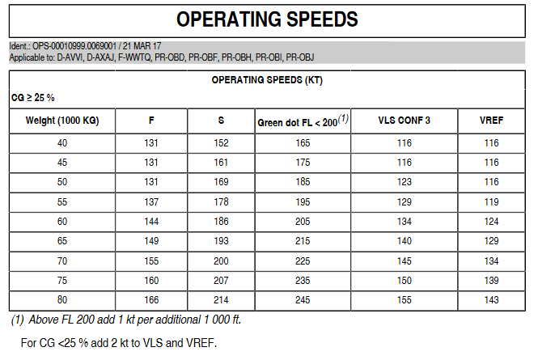
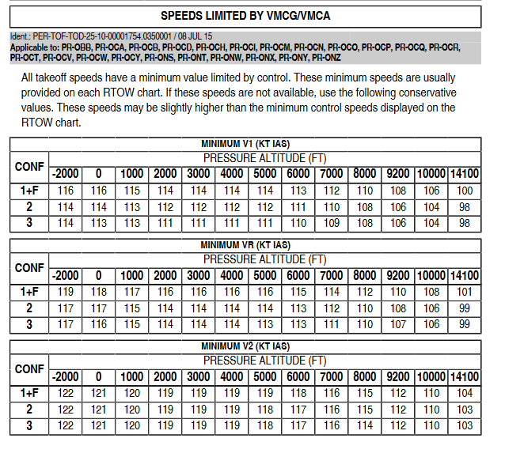
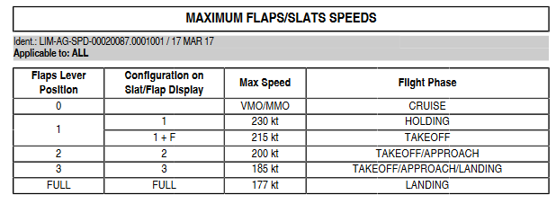
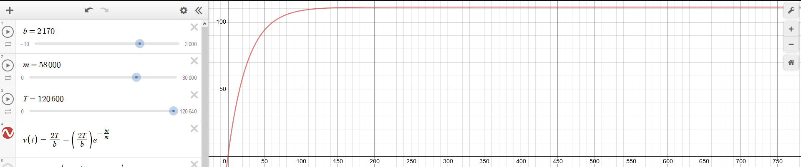
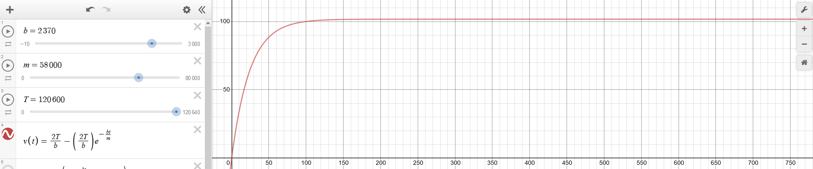
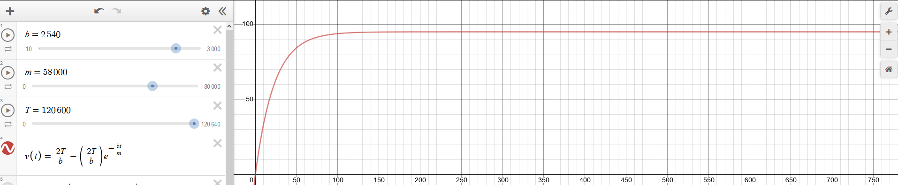

---
title: EFB Takeoff Calculations
...

In the real world for calculating takeoff performance (V.Speeds, Flex Temp etc.) several RTOW charts are produced which are specific
to that runway, and specific runway conditions. The Airbus FCOM does not directly state how to calculate V.Speeds, they are obtained from the RTOW charts
for the specific runway.

For the EFB, we are not able to store every RTOW chart for every airport. Therefore we must try to calculate the V.Speeds ourselves in a similar way
to how they would be determined for RTOW charts, based on the factors that affect takeoff performance (wind, runway length, runway condition, temperature,
pressure etc.).

This document details the methods that can be used to gain accurate estimates for what data is likely to be published by the airport authority for given runway
lengths and environmental conditions.

# Stall speeds
Stall speeds contribute to the minimum values for V2 and VR.
We already have stall speeds calculated which are used in the CDU we will use, determined from the QRH.



# V2
V2 speed can be calculated as the maximum of the following values:

 - Stall speed * 1.13
 - Speed obtained from FCOM VMCG/VMCA table for the selected flap configuration and pressure altitude
 - Speed obtained from FCOM VMU/VMCA table for the pressure altitude and takeoff weight

All of this data is available from the FCOM.


")
")
")

# VR
VR must be calculated as the greater of:

 - Stall speed * Safety Margin
 - Speed obtained from FCOM VMCG/VMCA table for the selected flap configuration and pressure altitude

The safety margin is a % margin which the stall speed is multiplied by.
This can be any arbitary value for our case, but should probably be under 10%.
For example, 1.05 = 5% safety margin.

# V1
The maths for calculating V1 is complicated. V1 must meet the following criteria:

 - Greater than the minimum speed obtained from the FCOM VMCG/VMCA table for the selected flap configuration and pressure altitude
 - Less than than the maximum speed at which the aircraft is able accelarate to and then stop within the runway length

The distance traveled in the time to accelerate to $V_1$, $V_{1_{dist}}$, plus the braking distance from $V_1$ speed, $B_{dist}$,
must be less than the available runway length.

We can calculate the $V_1$ speed provided we know:

* The mass of the aircraft
	* Input by the user into the EFB
* Runway length
    * Input by the user into the EFB
* The thrust of the aircraft
    * The thrust of the engines used on the A320NEO, CFM International LEAP 1A26, [is rated at 120.64kN takeoff thrust](https://en.wikipedia.org/wiki/CFM_International_LEAP#Specifications). We can simply multiply this by 2 to get the thrust
* The drag constant due to air resistance on the aircraft
    * This can be found based on FCOM data, which will be explained later

## Overview

First, find the value of $\rho$ for the air pressure and temperature:

$\rho = \frac{p}{287.058 \times \text{temp}}$

Where $p$ is pressure **in Pascals** and $\text{temp}$ is the temperature **in Kelvin**.

Then find $b$ for the given flap configuration:

* $Cd_1 = 1671.16$ Flaps 1 + F
* $Cd_2 = 1825.18$ Flaps 2
* $Cd_3 = 1956.10$ Flaps 3

$b = Cd \times \rho$

Then find the thrust $T$ per engine:

If $\rho >= 1.2985$ then $T = T_{\text{MAX}}$, otherwise $T = T_{\text{MAX}} \times \frac{\rho}{1.2985}$

Then the acceleration distance ($D_{V_1}$), braking distance ($D_{\text{BRAKE}}$) and total distance ($D_{RTO}$) for a rejected takeoff for a given candidate $V_1$ speed can be calculated with the following functions:

$D_{\text{RTO}} = D_{V_1}(V) + D_{\text{BRAKE}}(V)$

$D_{V_1}(V) = D(t(V))$

$D_{\text{BRAKE}}(V) = \frac{mV^2}{2B}$

$D(t) = 2T (\frac{me^{\frac{-bt}{m}} - m}{b^2} + \frac{t}{b})$

$t(V) = \frac{-m \ln (1 - \frac{Vb}{2T})}{b}$

Where:

* $V$ is the candidate $V_1$ speed, in m/s
* $B$ is the braking force of the brakes at max in Newtons. The real value of this is currently unknown, likely higher than $T$
* $T$ is the thrust of a single engine in Newtons. The A320NEO CFM International LEAP 1A26, [is rated at 120,640N takeoff thrust](https://en.wikipedia.org/wiki/CFM_International_LEAP#Specifications)
* $b$ is the drag coefficient
* $m$ is the aircraft mass in KGs

The output of the distance functions is in meters.

Iteratively increase the candidate speed, starting from the stall speed, to find the highest value that $D_{\text{RTO}}$ is not longer than the available runway length.

If $V_R$ is a valid $V_1$ speed, then $V_1 = V_R$

If the RTO distance of stall speed $\times$ safety margin is longer than the available runway length, then safe takeoff is not possible.

## Proof

### Finding velocity by time equation
First, we need to calculate an equation for finding the velocity of the aircraft at a given point in time during the takeoff accelaration ($V \leq V_1$).
Using Newton's second law, where:

* $F$ is the combined force on the aircraft in the horizontal direction in Newtons
* $m$ is the aircraft mass in Kgs
* $V$ is the aircraft velocity in m/s
* $t$ is elapsed time since thrust is applied
* $T$ is the thrust provided by a single engine
* $b$ is the drag constant for the aircraft (will be determined later)
* $D$ is the displacement from start position
\begin{align*}
\text{Newton's second law} \\
ma &= F \\
m \frac{dV}{dt} &= F && F = 2T - bV \\
\text{Substitute thrust minus air resistance} \\
m \frac{dV}{dt} &= 2T - dV \\
m dV &= dt(2T -bV) \\
\frac{dv}{2T -bV} &= \frac{dt}{m} \\
\text{Integrate to solve for } V \\
\int \frac{dV}{2T - bV} &= \int \frac{dt}{m} \\
&= - \frac{1}{b} \int \frac{-b}{2T-bV}dV \\
&= - \frac{1}{b} \ln (2T - bV) \\
-\frac{1}{b} \ln (2T - bV) &= \frac{t}{m} + C \\
-ln(2T - bV) &= \frac{-bt}{m} - bC \\
|2T - bV| &= e^{\frac{-bt}{m}}e^{-bc} \\
2T - bV &= \pm e^{\frac{-bt}{m}}e^{-bc} \\
2T - bV &= Ae^{\frac{-bt}{m}} \\
\text{This gives the general formula of velocity:} \\
V = \frac{2T - Ae^{\frac{-bt}{m}}}{b} \\
\end{align*}

\clearpage
Now substitude our initial $V_0 = 0$ to find the equation specific to starting from rest

\begin{align*}
A &= 2T - V_0 b && V_0 = 0 \\
A &= 2T \\
V &= \frac{2T}{b} - \frac{2T}{b}e^{\frac{-bt}{m}}
\end{align*}

### Getting values for air resistance constant
The limit of the velocity equation is the maximum speed the plane can reach with the given thrust, which we can use to obtain the air resistance contant $b$.
We could calculate the limit mathematically to determine this, however it is much easier to use a graphing tool (Desmos was used for this example) to plot the
velocity and vary the $b$ value until the limit lands on our target value. Mass has no effect on the limit of the curve, only the initial gradient.

The operating speed limits for the A320NEO are published in the FCOM Limitations.



Note that the chart is in knots but the speed unit for the equation is m/s. Convert knots to m/s by multiplying by $0.51 \overline{4}$.
This gives us maximum speeds of ~111 m/s for 1 + F, ~103 m/s for 2 and ~95 m/s for 3.

Varying $b$ to find the correct limit gives the following values:

* $b_1 = 2170$ Flaps 1 + F
* $b_2 = 2370$ Flaps 2
* $b_3 = 2540$ Flaps 3





### Finding displacement by time equation
We now need to find the equation for displacement by time, which will be used to work out how far we travel before hitting $V_1$.
This is simply the integral of the velocity equation.

\begin{align*}
V = \frac{dD}{dt} &= \frac{2T}{b} - \frac{2T}{b}e^{-bt}{m} \\
D &= \int (\frac{2T}{b} - \frac{2T}{b}e^{-bt}{m}) dt\\
D &= \frac{2Tt}{b} - \frac{\frac{2Tt}{b}e^{-bt}{m}}{(\frac{-bt}{m})} + C \\
D &= \frac{2Tt}{b} - \frac{2TMe^{-bt}{m}}{b^2} + C
\end{align*}

Now we substitute $D = 0$ at $t = 0$ to find C, and simplify

\begin{align*}
\frac{2Tme^0}{b^2} + C = 0 \\
C = \frac{-2Tm}{b^2}
\end{align*}

\begin{align*}
\therefore D &= \frac{2mTe^{\frac{-bt}{m}}}{b^2} + \frac{2Tt}{b} - \frac{2Tm}{b^2} \\
D &= 2T(\frac{me^{\frac{-bt}{m}} - m}{b^2} + \frac{t}{b})
\end{align*}

### Finding time by velocity
We need to know what time we hit $V_1$ at so that we can use that time in our displacement equation.
We can find an equation for time given velocity by re-arranging the velocity equation to make $t$ the subject.

\begin{align*}
V &= \frac{2T}{b} - \frac{2T}{b}e^{\frac{-bt}{m}} \\
\frac{2T}{b}e^{\frac{-bt}{m}} &= \frac{2T}{b} - V \\
2Te^{\frac{-bt}{m}} &= 2T - Vb \\
e^{\frac{-bt}{m}} &= 1 - \frac{Vb}{2T} \\
\frac{-bt}{m} &= \ln(1 - \frac{Vb}{2T}) \\
t = \frac{-m \ln (1 - \frac{Vb}{2T})}{b}
\end{align*}

### Finding braking distance
The kinetic energy of the plane at $v_1$ is $\frac{1}{2} m {v_1}^2$ where $m$ is the mass of the plane in KGs.
The energy required by the brakes bringing the kinetic energy to 0 is $Bd$, where $B$ is the braking force applied and $d$ is the distance the force was applied over (the stopping distance)

\begin{align*}
\frac{1}{2} m {v_1}^2 &= Bd \\
d &= \frac{mv^2}{2B}
\end{align*}

The exact braking force $B$ of the A320 is not known, but an estimate will suffice here.

Our final function for braking distance for a given velocity is

$D_{\text{BRAKE}}(V) = \frac{mV^2}{2B}$

### Computing candidate speeds to find $V_1$
We now have all of the functions we need:

* $D(t)$ Gives the distance travelled while accelerating for a given time
* $t(V)$ Gives the time we reach a given velocity
* $D_{\text{BRAKE}}(V)$ Gives braking distance for a given velocity

From this we can find the rejected takeoff distance $D_{\text{RTO}}$ for a candidate $V_1$ speed.

$D_{\text{RTO}}(V) = D(t(V)) + D_{\text{BRAKE}}(V)$

We can then iteratively compute RTO distances for different speeds.

Begin at the stall speed * safety margin. Compute $D_{\text{RTO}}$ for this speed.
If $D_{\text{RTO}}$ of stall speed * safety margin is longer than runway, then
safe takeoff is not possible.

Gradually increase the candidate speed until the RTO distance is longer than the available runway length,
or we reach the calculated $V_R$ speed, whichever is sooner.

If $V_R$ is a valid $V_1$ speed, then $V_1 = V_R$. Otherwise, the last valid candidate speed is $V_1$

### Effect of pressure and temperature on V1
Up until now we have ignored the effect of pressure and temperature - these are included in the constant $b$. However the value for $b$ should really be $b = C_d * \rho$ where $C_d$ is a constant specific to the aircraft/flaps configuration and $\rho$ is air density.

Air density $\rho$ is given as $\rho = \frac{p}{R_{\text{specific}}T}$ where $p$ is pressure in Pa, $R_{\text{specific}}$ for dry air is 287.058 J/(kg K) and $T$ is temperature in Kelvin.

Pressure in millibars can be converted to Pa by by multiplying by 100. Temperature in Celcius can be converted to Kelvin by adding 273.15.

Our previous values where for at the International Standard Atmosphere, which has a $\rho$ of 1.2985. We can find $C_d$ by dividing by this constant:

* $Cd_1 = 2170 / 1.2985 = 1671.16$ Flaps 1 + F
* $Cd_2 = 2370 / 1.2985 = 1825.18$ Flaps 2
* $Cd_3 = 2540 / 1.2985 = 1956.10$ Flaps 3

Then $b = Cd (\frac{p}{287.058 \times \text{temp}})$

The air density will also affect the performance of the engines. A linear approximation of this effect will be sufficient.

If $\rho < 1.2985$ then:

$\text{Thrust} = \text{Thrust}_{\text{MAX}} \times \frac{\rho}{1.2985}$

https://en.wikipedia.org/wiki/Density_of_air

https://en.wikipedia.org/wiki/International_Standard_Atmosphere

### Raise to minimum chart value
If the calculated possible $V_1$ value is less than indicated in the FCOM VMCG/VMCA charts listed at the start of this document, $V_1$ should be raised to this minimum.

# Adjustments after calculation
Once $V_1$, $V_R$ and $V_2$ have been independently calculated, they should be adjusted as follows:

* If $V_R < V_1$: $V_R = V_1$
* If $V_2 < V_R$: $V_2 = V_R$


# Generating this document

Generate this document as a PDF with LaTeX from the markdown using pandoc.
```
pandoc .\efb-takeoff-calculations.md -o .\efb-takeoff-calculations.pdf
```
